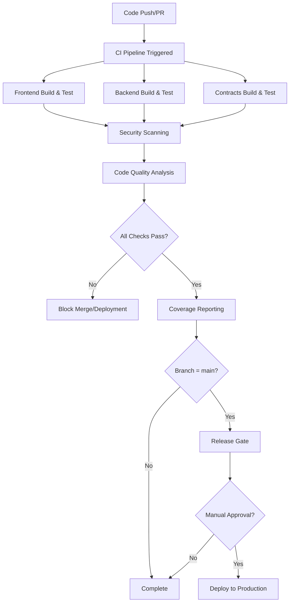

# CI/CD Pipeline Documentation

**Last Updated:** 2025-11-25  
**Pipeline Version:** 1.0.0  
**Status:** ✅ Operational

---

## Overview

The Takumi platform uses GitHub Actions for comprehensive continuous integration and continuous deployment (CI/CD) automation. The pipeline enforces quality gates, security scanning, test coverage requirements, and mainnet deployment protection.

## Pipeline Architecture

### Workflow Files

| Workflow | File | Purpose | Triggers |
|----------|------|---------|----------|
| **Main CI Pipeline** | `.github/workflows/ci.yml` | Build, test, security, quality gates | Push, PR, Manual |
| **Security Scanning** | `.github/workflows/security-scan.yml` | Vulnerability scanning | Daily, Push, PR, Manual |
| **Coverage Reporting** | `.github/workflows/coverage-report.yml` | Test coverage tracking | Push, PR, Manual |

### Pipeline Flow



---

## Main CI Pipeline

**File:** `.github/workflows/ci.yml`

### Jobs

#### 1. Frontend Build & Test

**Purpose:** Validate frontend code quality, build, and test coverage

**Steps:**
1. Checkout code
2. Setup pnpm and Node.js
3. Install dependencies
4. Lint frontend code
5. Type check TypeScript
6. Build production bundle
7. Run tests with coverage
8. Upload coverage to Codecov
9. Archive build artifacts

**Environment Variables:**
- `VITE_CHAIN=sepolia` (testnet build)

**Artifacts:**
- `frontend-dist/` - Production build (7 days retention)
- Coverage reports uploaded to Codecov

**Success Criteria:**
- ✅ Zero linting errors
- ✅ Zero TypeScript errors
- ✅ Build completes successfully
- ✅ All tests pass
- ⚠️ Coverage ≥95% (warning if below)

#### 2. Backend Build & Test

**Purpose:** Validate backend code quality, build, and test coverage with database integration

**Services:**
- PostgreSQL 15 (test database)

**Steps:**
1. Checkout code
2. Setup pnpm and Node.js
3. Install backend dependencies
4. Lint backend code
5. Type check TypeScript
6. Build backend
7. Run database migrations
8. Run tests with coverage
9. Upload coverage to Codecov
10. Check coverage threshold

**Environment Variables:**
```bash
DB_HOST=localhost
DB_PORT=5432
DB_NAME=takumi_test
DB_USER=test
DB_PASSWORD=test
DB_SSL=false
NODE_ENV=test
JWT_SECRET=test-secret-key-for-ci-only
ENCRYPTION_KEY=test-encryption-key-32-bytes-long
```

**Success Criteria:**
- ✅ Zero linting errors
- ✅ Zero TypeScript errors
- ✅ Build completes successfully
- ✅ Database migrations successful
- ✅ All tests pass
- ⚠️ Coverage ≥95% (warning if below)

#### 3. Smart Contracts Build & Test

**Purpose:** Validate smart contract code quality, build, test, and security

**Steps:**
1. Checkout code with submodules
2. Install Foundry toolchain
3. Install contract dependencies
4. Build contracts with size report
5. Run contract tests
6. Generate coverage report
7. Upload coverage to Codecov
8. Check coverage threshold
9. Run Slither static analysis

**Success Criteria:**
- ✅ All contracts compile successfully
- ✅ All tests pass
- ✅ Coverage ≥95% (warning if below)
- ⚠️ Slither analysis completes (warnings allowed)

#### 4. Security Scanning

**Purpose:** Identify vulnerabilities in dependencies, code, and Docker images

**Scans:**
- **Trivy (filesystem):** Scan codebase for vulnerabilities
- **Snyk:** Dependency vulnerability scanning
- **npm audit:** Node.js dependency audit
- **OWASP Dependency Check:** Comprehensive dependency analysis

**Outputs:**
- SARIF files uploaded to GitHub Security tab
- Artifact reports (30 days retention)

**Success Criteria:**
- ⚠️ All scans complete (warnings allowed)
- ❌ CRITICAL/HIGH vulnerabilities block merge to main

#### 5. Code Quality Analysis (SonarQube)

**Purpose:** Enforce code quality standards and best practices

**Metrics:**
- Code smells
- Technical debt
- Duplications
- Maintainability rating
- Reliability rating
- Security rating

**Configuration:**
```properties
sonar.projectKey=takumi-platform
sonar.sources=src,backend/src,contracts/src
sonar.tests=test,backend/test,contracts/test
sonar.javascript.lcov.reportPaths=coverage/lcov.info,backend/coverage/lcov.info
```

**Success Criteria:**
- ✅ Quality gate passes
- ⚠️ Warnings allowed for non-blocking issues

#### 6. Docker Build & Security Scan

**Purpose:** Build and scan backend Docker image for vulnerabilities

**Steps:**
1. Setup Docker Buildx
2. Build backend Docker image
3. Run Trivy vulnerability scanner
4. Upload scan results

**Success Criteria:**
- ✅ Docker image builds successfully
- ⚠️ Trivy scan completes (warnings allowed)
- ❌ CRITICAL/HIGH vulnerabilities in image block deployment

#### 7. Integration Tests

**Purpose:** Validate full-stack integration

**Triggers:** Push to main or staging branches only

**Steps:**
1. Start services with Docker Compose
2. Wait for services to be healthy
3. Run integration tests
4. Stop services

**Success Criteria:**
- ✅ All services start successfully
- ✅ All integration tests pass

#### 8. Release Gate (Mainnet Protection)

**Purpose:** Enforce mainnet deployment requirements

**Triggers:** Push to main branch only

**Requirements:**
- ✅ All test suites passed
- ✅ Coverage ≥95% for all components
- ✅ Security scans completed
- ✅ Code quality gate passed
- ⚠️ Manual approval required for deployment

**Outputs:**
- Release notes artifact (30 days retention)
- Release version tag

**Manual Approval Checklist:**
- [ ] Professional security audit completed
- [ ] All stakeholder sign-offs obtained
- [ ] Release notes reviewed
- [ ] Deployment runbook verified
- [ ] Rollback plan tested
- [ ] Monitoring verified

#### 9. Deploy (Manual Trigger Only)

**Purpose:** Deploy to production environment

**Triggers:** Manual workflow dispatch on main branch only

**Environment:** `production`

**Steps:**
1. Deployment notification
2. Deploy frontend
3. Deploy backend
4. Deploy contracts (if needed)
5. Post-deployment verification

**Success Criteria:**
- ✅ All deployments successful
- ✅ Health checks pass
- ✅ Smoke tests pass

---

## Security Scanning Pipeline

**File:** `.github/workflows/security-scan.yml`

### Schedule

- **Daily:** 2:00 AM UTC
- **On-demand:** Push to main, Pull Requests, Manual dispatch

### Scanning Jobs

#### 1. Dependency Vulnerability Scanning

**Tools:**
- npm audit (root and backend)

**Outputs:**
- JSON audit reports (30 days retention)

**Severity Levels:**
- CRITICAL: Immediate action required
- HIGH: Action required before merge
- MEDIUM: Review and plan remediation
- LOW: Monitor and address in maintenance

#### 2. Snyk Security Scan

**Coverage:**
- All Node.js projects
- All dependencies
- Transitive dependencies

**Configuration:**
```bash
--all-projects
--severity-threshold=medium
```

**Outputs:**
- SARIF file uploaded to GitHub Security
- Detailed vulnerability report

#### 3. Trivy Comprehensive Scanning

**Scan Types:**
- **Filesystem:** Scan all code and dependencies
- **Configuration:** Scan IaC and config files

**Severity Levels:**
- CRITICAL, HIGH, MEDIUM

**Outputs:**
- SARIF files for each scan type
- Uploaded to GitHub Security tab

#### 4. Smart Contract Security Analysis

**Tools:**
- **Slither:** Static analysis for Solidity
- **Mythril:** Symbolic execution analysis

**Configuration:**
```bash
slither . \
  --exclude-dependencies \
  --exclude-informational \
  --exclude-low \
  --json slither-report.json
```

**Outputs:**
- JSON report (30 days retention)
- Vulnerability classifications

#### 5. Secrets Scanning

**Tools:**
- **TruffleHog:** Detect secrets in code and history
- **GitLeaks:** Scan for hardcoded credentials

**Configuration:**
```bash
--only-verified  # TruffleHog: Only verified secrets
```

**Outputs:**
- Alerts for detected secrets
- Immediate notification to security team

#### 6. Docker Image Scanning

**Tools:**
- Trivy (container image scan)
- Snyk (container vulnerability scan)

**Images Scanned:**
- `takumi-backend:scan`

**Outputs:**
- SARIF files uploaded to GitHub Security
- Vulnerability reports

#### 7. OWASP Dependency Check

**Coverage:**
- All project dependencies
- Known CVEs
- Retired dependencies

**Configuration:**
```bash
--enableRetired
--enableExperimental
--suppression dependency-check-suppressions.xml
```

**Outputs:**
- HTML, JSON, SARIF reports (30 days retention)

#### 8. Security Summary Report

**Purpose:** Aggregate all security scan results

**Outputs:**
- Markdown summary report (90 days retention)
- PR comment with security status
- Recommendations for remediation

**Report Sections:**
- Scan results table
- Severity breakdown
- Remediation recommendations
- Trend analysis

---

## Coverage Reporting Pipeline

**File:** `.github/workflows/coverage-report.yml`

### Coverage Jobs

#### 1. Frontend Coverage Report

**Metrics:**
- Lines coverage
- Statements coverage
- Functions coverage
- Branches coverage

**Integrations:**
- Codecov (trend tracking)
- Coveralls (parallel reporting)

**Outputs:**
- Coverage badges
- HTML coverage report (30 days retention)
- PR comment with coverage summary

**Threshold:** 95% for all metrics

#### 2. Backend Coverage Report

**Database Integration:**
- PostgreSQL test database
- Automated migrations

**Metrics:**
- Lines coverage
- Statements coverage
- Functions coverage
- Branches coverage

**Integrations:**
- Codecov (trend tracking)
- Coveralls (parallel reporting)

**Outputs:**
- Coverage summary JSON
- HTML coverage report (30 days retention)

**Threshold:** 95% for all metrics

#### 3. Smart Contracts Coverage Report

**Tool:** Forge coverage

**Metrics:**
- Line coverage
- Branch coverage
- Function coverage

**Outputs:**
- LCOV report
- Coverage summary text

**Threshold:** 95% overall coverage

#### 4. Combined Coverage Report

**Purpose:** Aggregate coverage across all components

**Report Format:**
```markdown
# Coverage Report

| Component | Lines | Statements | Functions | Branches | Status |
|-----------|-------|------------|-----------|----------|--------|
| Frontend  | 96.5% | 96.2%      | 95.8%     | 94.1%    | ✅     |
| Backend   | 97.3% | 97.1%      | 96.5%     | 95.2%    | ✅     |
| Contracts | 98.1% | -          | -         | -        | ✅     |
```

**Integrations:**
- Codecov dashboard
- Coveralls dashboard
- GitHub PR comments
- GitHub job summary

**Coverage Gate:**
- ✅ All components ≥95%: Pass
- ⚠️ Any component <95%: Warning (doesn't block)
- ❌ Any component <90%: Fail (blocks mainnet)

---

## Required GitHub Secrets

### Security Scanning

```bash
SNYK_TOKEN=<snyk-api-token>
SONAR_TOKEN=<sonarqube-token>
SONAR_HOST_URL=<sonarqube-url>
```

### Coverage Reporting

```bash
CODECOV_TOKEN=<codecov-token>
COVERALLS_REPO_TOKEN=<coveralls-token>
```

### Deployment (Optional)

```bash
# Vercel
VERCEL_TOKEN=<vercel-token>
VERCEL_ORG_ID=<vercel-org-id>
VERCEL_PROJECT_ID=<vercel-project-id>

# AWS
AWS_ACCESS_KEY_ID=<aws-key>
AWS_SECRET_ACCESS_KEY=<aws-secret>
AWS_REGION=<aws-region>

# Docker Registry
DOCKER_USERNAME=<docker-username>
DOCKER_PASSWORD=<docker-password>
```

---

## Quality Gates

### Merge to Main Requirements

**Automated Gates:**
1. ✅ All tests passing (frontend, backend, contracts)
2. ✅ Coverage ≥95% for all components
3. ✅ Zero CRITICAL/HIGH security vulnerabilities
4. ✅ SonarQube quality gate passed
5. ✅ All linting and type checks passed
6. ✅ Docker images build successfully

**Manual Gates:**
1. ⚠️ Code review approved (minimum 1 reviewer)
2. ⚠️ Security review for sensitive changes

### Mainnet Deployment Requirements

**Automated Gates:**
1. ✅ All merge requirements met
2. ✅ Integration tests passed
3. ✅ Docker security scans passed
4. ✅ Release notes generated

**Manual Gates:**
1. ⚠️ Professional security audit completed
2. ⚠️ All stakeholder approvals obtained
3. ⚠️ Deployment runbook verified
4. ⚠️ Rollback plan tested
5. ⚠️ Monitoring and alerting verified

---

## Monitoring & Alerts

### Pipeline Health Metrics

**Tracked Metrics:**
- Build success rate (target: >95%)
- Average build time (target: <15 minutes)
- Test flakiness rate (target: <1%)
- Security scan findings (trend over time)
- Coverage trends (should increase over time)

### Alerts

**Build Failures:**
- Immediate notification to development team
- Slack/email alerts configured
- GitHub status checks block merge

**Security Vulnerabilities:**
- CRITICAL: Immediate notification to security team
- HIGH: Notification within 1 hour
- MEDIUM: Daily digest
- LOW: Weekly digest

**Coverage Drops:**
- Warning if coverage drops >1%
- Alert if coverage drops >5%
- Block merge if coverage <90%

### Dashboards

**GitHub Actions:**
- Workflow status and history
- Job execution times
- Artifact storage usage

**Codecov:**
- Coverage trends over time
- File-level coverage details
- PR coverage impact

**SonarQube:**
- Code quality metrics
- Technical debt tracking
- Security hotspots

**GitHub Security:**
- Vulnerability alerts
- Dependency graph
- Security advisories

---

## Troubleshooting

### Common Issues

#### Build Failures

**Symptoms:**
- Tests failing intermittently
- Build timeouts
- Dependency installation errors

**Solutions:**
1. Check GitHub Actions logs for specific errors
2. Verify dependencies are locked (`pnpm-lock.yaml`)
3. Ensure environment variables are set correctly
4. Check for flaky tests and add retries
5. Increase job timeout if needed

#### Security Scan Failures

**Symptoms:**
- New vulnerabilities detected
- False positive alerts
- Scan timeouts

**Solutions:**
1. Review SARIF results in GitHub Security tab
2. Update vulnerable dependencies
3. Add suppressions for false positives in `dependency-check-suppressions.xml`
4. Document risk acceptance for known issues
5. Contact security team for guidance

#### Coverage Drops

**Symptoms:**
- Coverage below threshold
- New uncovered code
- Coverage report generation failures

**Solutions:**
1. Identify uncovered code in Codecov dashboard
2. Add missing tests for new code
3. Review coverage exclusions in config files
4. Check for test failures masking coverage issues
5. Verify coverage report upload succeeded

#### Deployment Failures

**Symptoms:**
- Deployment job fails
- Health checks fail
- Services not starting

**Solutions:**
1. Check deployment logs in GitHub Actions
2. Verify all secrets are configured correctly
3. Test deployment locally with same configuration
4. Review rollback procedures
5. Check service health endpoints
6. Verify environment variables are set

### Getting Help

**Internal Support:**
- Development Team: dev@takumi.example
- Security Team: security@takumi.example
- DevOps Team: devops@takumi.example

**External Resources:**
- GitHub Actions Documentation: https://docs.github.com/actions
- Codecov Documentation: https://docs.codecov.com
- Snyk Documentation: https://docs.snyk.io
- SonarQube Documentation: https://docs.sonarqube.org

---

## Maintenance

### Regular Tasks

**Weekly:**
- Review security scan results
- Update dependencies with patches
- Review coverage trends
- Check for flaky tests

**Monthly:**
- Review and update suppressions
- Audit GitHub Secrets rotation
- Review pipeline performance metrics
- Update documentation

**Quarterly:**
- Review and optimize pipeline configuration
- Update tool versions (Foundry, Node.js, etc.)
- Conduct pipeline security audit
- Review and update quality gates

### Pipeline Updates

**Process:**
1. Create feature branch for pipeline changes
2. Test changes in feature branch
3. Review changes with team
4. Merge to main after approval
5. Monitor first few runs for issues
6. Document changes in this file

**Best Practices:**
- Test pipeline changes in feature branches
- Use workflow dispatch for manual testing
- Keep workflows DRY (Don't Repeat Yourself)
- Document all custom actions
- Version control all configurations

---

## Compliance & Audit Trail

### Audit Logging

**Logged Events:**
- All workflow runs (success/failure)
- Security scan results
- Coverage reports
- Deployment events
- Manual approvals

**Retention:**
- Workflow logs: 90 days (GitHub default)
- Artifacts: 7-90 days (configurable)
- Security reports: 90 days minimum
- Coverage reports: 90 days minimum

### Compliance Requirements

**SOC 2:**
- Automated security scanning
- Access control enforcement
- Audit trail maintenance
- Incident response procedures

**ISO 27001:**
- Security controls documentation
- Risk assessment and management
- Continuous monitoring
- Regular security reviews

**GDPR:**
- Data protection by design
- Security incident response
- Regular security testing
- Documentation of processing activities

---

## Future Enhancements

### Planned Improvements

**Short-term (Q1 2026):**
- [ ] Add E2E testing with Playwright
- [ ] Implement performance testing
- [ ] Add visual regression testing
- [ ] Enhance security scanning with additional tools

**Medium-term (Q2 2026):**
- [ ] Implement canary deployments
- [ ] Add blue-green deployment strategy
- [ ] Enhance monitoring and observability
- [ ] Implement automated rollback

**Long-term (Q3-Q4 2026):**
- [ ] Multi-region deployment support
- [ ] Advanced chaos engineering
- [ ] AI-powered code review
- [ ] Predictive failure analysis

---

**Document Version:** 1.0.0  
**Last Updated:** 2025-11-25  
**Next Review:** 2026-01-25  
**Owner:** DevOps Team  
**Approver:** CTO
