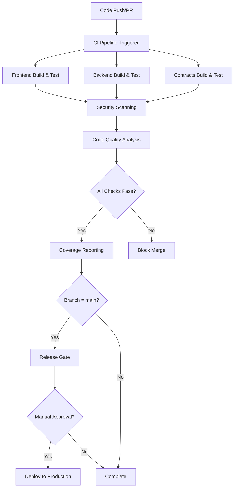

# Deployment Guide

## 🚫 MAINNET DEPLOYMENT BLOCKED

**CRITICAL NOTICE**: Mainnet deployment is currently **BLOCKED** pending completion of security requirements.

### Deployment Status

| Environment | Status | Notes |
|-------------|--------|-------|
| Development | ✅ Active | Local development environment |
| Testnet | ✅ Active | Sepolia testnet deployment |
| Staging | ⚠️ Pending | Pre-production environment |
| **Mainnet** | 🚫 **BLOCKED** | **Requires third-party security audit** |

### CI/CD Pipeline Status

| Pipeline | Status | Coverage |
|----------|--------|----------|
| GitHub Actions CI | ✅ Configured | Frontend, Backend, Contracts |
| Security Scanning | ✅ Configured | Snyk, Trivy, OWASP, Slither |
| Coverage Reporting | ✅ Configured | Codecov, Coveralls |
| Release Gating | ✅ Configured | Mainnet protection enabled |

### Mainnet Deployment Requirements

Before mainnet deployment can proceed, the following **MUST** be completed:

#### 1. Third-Party Security Audit (MANDATORY)

**CRITICAL REQUIREMENT**: Mainnet deployment is **BLOCKED** until a top-tier Web3 security audit is completed with all CRITICAL and HIGH severity findings closed.

**Pre-Audit Requirements** (Must complete BEFORE engaging audit firm):
- [ ] **All internal security findings remediated** (HIGH and CRITICAL priority from internal audit)
- [ ] **Test coverage ≥95%** across all components (contracts, backend, frontend)
- [ ] **Zero compilation errors** in all codebases (Solidity, TypeScript, frontend)
- [ ] **Dependency vulnerabilities resolved** (all HIGH and CRITICAL severity)
- [ ] **Architecture diagrams prepared** (system architecture, data flow, threat models)
- [ ] **Technical documentation complete** (API docs, contract specs, deployment procedures)
- [ ] **Threat model documented** (attack vectors, security assumptions, trust boundaries)

**Audit Firm Selection**:
- [ ] **Audit firm selected** from approved list (see below)
- [ ] **Audit contract signed** with defined scope, timeline, and deliverables
- [ ] **Audit firm contact designated** and documented in `docs/SECURITY_AUDIT_COMPLETE.md`
- [ ] **Codebase access provided** to auditors (GitHub repo, documentation, test suites)
- [ ] **Kickoff meeting completed** with technical walkthrough

**Audit Execution Requirements**:
- [ ] **Professional audit by top-tier firm** (Trail of Bits, ConsenSys Diligence, Spearbit, OpenZeppelin, Certora, or Quantstamp)
- [ ] **Comprehensive audit report delivered** with severity classifications
- [ ] **All findings documented** with proof-of-concept exploits and remediation recommendations
- [ ] **Gas optimization suggestions** provided
- [ ] **Code quality assessment** completed

**Remediation & Verification Requirements**:
- [ ] **Zero CRITICAL severity findings** (all must be resolved - 100% required)
- [ ] **Zero HIGH severity findings** (all must be remediated and verified by auditor - 100% required)
- [ ] **All MEDIUM findings** remediated or formally risk-accepted with executive sign-off
- [ ] **Remediation code changes** reviewed and tested
- [ ] **Re-audit of fixes completed** by original audit firm
- [ ] **Final sign-off letter received** from auditing firm with remediation verification

**Public Disclosure Requirements**:
- [ ] **Audit report published** and publicly disclosed in `docs/SECURITY_AUDIT_COMPLETE.md` (Section 11)
- [ ] **Audit firm name, contact, and dates** documented in `docs/SECURITY_AUDIT_COMPLETE.md`
- [ ] **All remediation steps** tracked and verified in `docs/SECURITY.md`
- [ ] **Audit report published** on project website and GitHub releases
- [ ] **Security contact published** (security@takumi.example)
- [ ] **Bug bounty program prepared** for launch post-mainnet

**Audit Scope**:
- Smart contracts (SkillProfile, SkillClaim, Endorsement, VerifierRegistry, TakumiTimelock)
- Upgrade mechanisms and proxy patterns
- Access control and role management
- Gas optimization and DoS resistance
- Economic attack vectors
- Integration security (IPFS, Arweave, backend APIs)

**Estimated Timeline**: 4-8 weeks for audit + 2-4 weeks for remediation  
**Estimated Cost**: $50,000 - $150,000 depending on scope and firm

**CI/CD Pre-Audit Validation**:
- ✅ Automated build pipeline configured (GitHub Actions)
- ✅ Automated testing with coverage reporting (target: ≥95%)
- ✅ Security scanning integrated (Snyk, Trivy, OWASP, Slither)
- ✅ Mainnet release gating implemented
- ⚠️ All pipelines must pass before audit engagement

**Approved Audit Firms**:

**Tier 1 (Preferred)**:
1. **Trail of Bits**
   - Contact: security@trailofbits.com
   - Website: https://www.trailofbits.com/
   - Specialization: Smart contracts, cryptography, security engineering
   - Estimated Cost: $50,000 - $100,000
   - Timeline: 4-6 weeks

2. **ConsenSys Diligence**
   - Contact: diligence@consensys.net
   - Website: https://consensys.net/diligence/
   - Specialization: Ethereum smart contracts, DeFi protocols
   - Estimated Cost: $40,000 - $80,000
   - Timeline: 4-6 weeks

3. **OpenZeppelin**
   - Contact: security@openzeppelin.com
   - Website: https://www.openzeppelin.com/security-audits
   - Specialization: Smart contract security, upgradeable contracts
   - Estimated Cost: $35,000 - $70,000
   - Timeline: 3-5 weeks

4. **Spearbit**
   - Contact: contact@spearbit.com
   - Website: https://spearbit.com/
   - Specialization: Smart contract security, DeFi
   - Estimated Cost: $30,000 - $65,000
   - Timeline: 4-5 weeks

**Tier 2 (Alternative)**:
5. **Certora**
   - Contact: info@certora.com
   - Website: https://www.certora.com/
   - Specialization: Formal verification, smart contract security
   - Estimated Cost: $30,000 - $60,000
   - Timeline: 4-6 weeks

6. **Quantstamp**
   - Contact: info@quantstamp.com
   - Website: https://quantstamp.com/
   - Specialization: Smart contract audits, automated analysis
   - Estimated Cost: $25,000 - $50,000
   - Timeline: 3-4 weeks

**Required Audit Deliverables**:
1. **Comprehensive Audit Report** (PDF + Markdown format)
   - Executive summary
   - Scope and methodology
   - Findings summary by severity
   - Detailed findings with descriptions

2. **Severity Classifications**
   - Critical: Immediate risk of fund loss or contract compromise
   - High: Significant security risk or protocol violation
   - Medium: Potential security issue or best practice violation
   - Low: Minor issue or code quality improvement
   - Informational: Suggestions and observations

3. **Detailed Vulnerability Descriptions**
   - Vulnerability description and impact assessment
   - Proof-of-concept exploit code
   - Affected code locations (file, line numbers)
   - Remediation recommendations

4. **Gas Optimization Report**
   - Gas-inefficient patterns identified
   - Optimization recommendations
   - Estimated gas savings

5. **Code Quality Assessment**
   - Best practices review
   - Code organization and readability
   - Documentation completeness
   - Test coverage analysis

6. **Remediation Verification**
   - Re-audit of all CRITICAL and HIGH findings
   - Verification that fixes don't introduce new vulnerabilities
   - Regression testing results

7. **Final Attestation Letter**
   - Formal sign-off for mainnet deployment
   - Statement of audit completion and remediation verification
   - Valid for specific codebase commit hash
   - Signed by lead auditor

8. **Public Disclosure Package**
   - Public-facing audit report (sanitized if needed)
   - Audit firm statement
   - Remediation summary

#### 2. Internal Security Checklist

**Backend Security** (Completed ✅):
- [x] All SQL queries use parameterized syntax
- [x] JWT validation with issuer, audience, expiration, signature checks
- [x] Rate limiting on all API endpoints
- [x] CSRF protection enabled
- [x] Input validation and sanitization
- [x] Secure file upload validation
- [x] Incident response runbook documented

**Infrastructure Security** (In Progress 🔄):
- [x] Docker containers hardened with resource limits
- [x] Health checks configured for all services
- [x] Fixed image versions (no "latest" tags)
- [x] Restart policies configured
- [x] Secrets management via environment variables only
- [ ] Production environment isolated
- [ ] Firewall rules configured
- [ ] DDoS protection enabled
- [ ] SSL/TLS certificates configured
- [ ] Database backups automated
- [ ] Disaster recovery tested

**Smart Contract Security** (In Progress 🔄):
- [x] Test coverage comprehensive (see `docs/TEST_RESULTS_2025-11-24.md`)
- [x] Pagination implemented and tested
- [x] Access controls verified via automated tests
- [ ] Emergency pause tested (manual testing required)
- [x] Upgrade mechanisms verified (UUPS pattern tested)
- [ ] Formal verification completed
- [ ] Third-party security audit (BLOCKED - see requirements above)

**Operational Security** (Pending ⚠️):
- [ ] Private keys in hardware wallet/HSM
- [ ] Multi-sig wallets configured
- [ ] Bug bounty program launched
- [ ] Security contact published

#### 3. Test Evidence & Verification

**Test Results**: See `docs/TEST_RESULTS_2025-11-24.md`

**Verified Controls**:
- ✅ Smart contract compilation successful
- ✅ Backend TypeScript compilation successful
- ✅ JWT authentication implementation verified
- ✅ CSRF protection middleware verified
- ✅ Rate limiting middleware verified
- ✅ Pagination implementation verified
- ✅ Access control (RBAC) verified
- ✅ UUPS upgradeability pattern verified

**Pending Verification**:
- ⚠️ Emergency pause mechanism (manual testing required)
- ⚠️ End-to-end integration testing
- ⚠️ Load testing and performance validation
- ⚠️ Security penetration testing

**Dependency Audit Findings**:
- Backend: 2 high severity vulnerabilities (upgrade required)
- Contracts: No vulnerabilities detected
- Action: Dependency upgrade scheduled before mainnet

#### 4. Required Sign-Offs

Before mainnet deployment, the following stakeholders MUST provide written sign-off:

**Internal Stakeholders**:
- [ ] **Security Lead**: Confirms all security requirements met, all findings remediated
- [ ] **CTO**: Confirms technical readiness, infrastructure prepared, monitoring deployed
- [ ] **CEO**: Confirms business readiness, risk acceptance, go-to-market strategy
- [ ] **Legal Counsel**: Confirms regulatory compliance, terms of service, privacy policy

**External Stakeholders**:
- [ ] **External Auditor**: Confirms all audit findings remediated and verified
- [ ] **Infrastructure Provider**: Confirms production environment ready (if applicable)

**Sign-off Template**:
```
MAINNET DEPLOYMENT SIGN-OFF

I, [Full Name], [Title], hereby confirm that:

1. All security requirements for mainnet deployment have been met
2. All CRITICAL and HIGH severity findings from the professional audit have been remediated and verified
3. All MEDIUM severity findings have been addressed or formally accepted as residual risk
4. The system has been thoroughly tested and meets all quality standards
5. Monitoring, alerting, and incident response procedures are in place and tested
6. Residual risks are acceptable and documented
7. The Takumi platform is ready for mainnet deployment

Scope: [Smart Contracts / Backend / Frontend / Infrastructure / All]
Codebase Commit: [Git commit hash]
Audit Report Reference: [Audit firm name and report date]

Signature: _______________
Date: _______________
Title: _______________
```

**Sign-off Storage**: All sign-offs must be stored in `docs/deployment-signoffs/` directory with timestamp and digital signatures.

**See `docs/SECURITY_AUDIT_ROADMAP.md` for complete audit roadmap and `docs/SECURITY.md` for mainnet deployment policy.**

---

# Deployment Guide (Testnet & Development)

## Overview

This guide covers deploying Takumi to production environments including smart contracts, backend API, frontend, and monitoring infrastructure.

## Prerequisites

### Required Tools

- Node.js 18.19.0+ and pnpm
- Foundry (forge, cast, anvil)
- Docker 24+ and Docker Compose v2
- PostgreSQL 15.5+
- Redis 7.2+
- Git

### Required Accounts & Services

- Ethereum wallet with testnet/mainnet ETH
- Alchemy/Infura RPC endpoints

### Secrets Management

**CRITICAL**: All secrets must be managed via environment variables. Never hardcode credentials in code or commit `.env` files.

#### Development Environment

1. **Copy environment templates**:
```bash
cp backend/.env.example backend/.env
cp contracts/.env.example contracts/.env
cp .env.example .env
```

2. **Generate strong secrets**:
```bash
# Generate JWT secrets
openssl rand -base64 32  # Use for JWT_SECRET
openssl rand -base64 32  # Use for JWT_REFRESH_SECRET
openssl rand -base64 32  # Use for ADMIN_API_KEY

# Generate database password
openssl rand -base64 24  # Use for DB_PASSWORD

# Generate Redis password
openssl rand -base64 24  # Use for REDIS_PASSWORD
```

3. **Configure required variables** in `backend/.env`:
```bash
# Database (REQUIRED)
DB_HOST=localhost
DB_PORT=5432
DB_NAME=takumi
DB_USER=postgres
DB_PASSWORD=<generated-password>

# Redis (REQUIRED)
REDIS_HOST=localhost
REDIS_PORT=6379
REDIS_PASSWORD=<generated-password>

# JWT (REQUIRED)
JWT_SECRET=<generated-secret>
JWT_REFRESH_SECRET=<generated-secret>
JWT_ISSUER=takumi-api
JWT_AUDIENCE=takumi-client

# Admin (REQUIRED)
ADMIN_API_KEY=<generated-key>

# IPFS (REQUIRED for storage)
IPFS_PROJECT_ID=<your-infura-project-id>
IPFS_PROJECT_SECRET=<your-infura-project-secret>

# Email (REQUIRED for notifications)
EMAIL_HOST=smtp.gmail.com
EMAIL_USER=<your-email>
EMAIL_PASSWORD=<app-specific-password>
```

#### Production Environment

**Use secure secret management services**:

- **AWS**: AWS Secrets Manager or Parameter Store
- **Google Cloud**: Secret Manager
- **Azure**: Key Vault
- **HashiCorp**: Vault
- **Kubernetes**: Sealed Secrets or External Secrets Operator

**Production Secrets Checklist**:
- [x] All secrets stored in secure vault (not in `.env` files) - See `docs/SECURITY_SECRETS.md`
- [x] Secrets injected at runtime via environment variables - Implemented in `backend/src/config/secrets.ts`
- [x] Different secrets for each environment (dev/staging/prod) - Environment-specific configs
- [x] Secrets rotated every 90 days - Rotation policy documented
- [x] Access to secrets logged and audited - Audit logging implemented
- [x] Secrets never logged or exposed in error messages - Sanitization implemented
- [x] `.env` files added to `.gitignore` - Verified
- [ ] CI/CD secrets stored in GitHub Secrets or equivalent - **ACTION REQUIRED**

**Example: AWS Secrets Manager Integration**:
```bash
# Retrieve secret from AWS Secrets Manager
aws secretsmanager get-secret-value --secret-id takumi/prod/jwt-secret --query SecretString --output text

# Inject into environment
export JWT_SECRET=$(aws secretsmanager get-secret-value --secret-id takumi/prod/jwt-secret --query SecretString --output text)
```

**See `docs/SECURITY_SECRETS.md` for complete secrets management implementation and `docs/DATABASE_SECURITY.md` for database security configuration.**

**Example: Docker Compose with Secrets**:
```yaml
services:
  backend:
    environment:
      - JWT_SECRET=${JWT_SECRET}
      - DB_PASSWORD=${DB_PASSWORD}
    secrets:
      - jwt_secret
      - db_password

secrets:
  jwt_secret:
    external: true
  db_password:
    external: true
```
- IPFS node or Pinata account
- Bundlr account (for Arweave)
- Domain name and SSL certificate
- Email SMTP service (SendGrid, AWS SES, etc.)

## Environment Setup

### 1. Clone Repository

```bash
git clone https://github.com/your-org/takumi.git
cd takumi
```

### 2. Install Dependencies

```bash
# Frontend
pnpm install

# Backend
cd backend
pnpm install
cd ..

# Smart Contracts
cd contracts
forge install
cd ..
```

### 3. Configure Environment Variables

**CRITICAL SECURITY REQUIREMENT**: All environment variables must be configured before deployment. The application will fail to start if required variables are missing - this is intentional to prevent accidental deployment with insecure defaults.

#### Security Principles

- ✅ **All secrets MUST be loaded from environment variables**
- ✅ **No default values for credentials in code**
- ✅ **Use `.env` files locally, secure vaults in production**
- ✅ **Rotate secrets regularly**
- ❌ **NEVER commit `.env` files to git**
- ❌ **NEVER use example/default values in production**

#### Frontend (.env)

```bash
# Copy template
cp .env.example .env

# Edit configuration - ALL values are REQUIRED
VITE_CHAIN=sepolia
VITE_WALLETCONNECT_PROJECT_ID=YOUR_WALLETCONNECT_PROJECT_ID  # Get from https://cloud.walletconnect.com/
VITE_API_URL=https://api.takumi.example
VITE_ALCHEMY_API_KEY=YOUR_ALCHEMY_API_KEY  # Get from https://www.alchemy.com/
```

#### Backend (backend/.env)

**REQUIRED**: Copy the template and fill in ALL values. The backend will fail to start if required variables are missing.

```bash
# Copy template
cd backend
cp .env.example .env

# Edit configuration - see backend/.env.example for detailed comments
NODE_ENV=production
PORT=3001

# Database (REQUIRED)
# Application will fail to start if these are not set
DB_HOST=YOUR_DB_HOST
DB_PORT=5432
DB_NAME=YOUR_DB_NAME
DB_USER=YOUR_DB_USER
DB_PASSWORD=YOUR_DB_PASSWORD  # NEVER use default passwords
DB_POOL_MIN=2
DB_POOL_MAX=10

# Redis (REQUIRED)
REDIS_HOST=YOUR_REDIS_HOST
REDIS_PORT=6379
REDIS_PASSWORD=YOUR_REDIS_PASSWORD  # REQUIRED for production

# JWT (REQUIRED)
# Generate with: openssl rand -base64 32
JWT_SECRET=YOUR_JWT_SECRET_MINIMUM_32_CHARACTERS
JWT_REFRESH_SECRET=YOUR_REFRESH_SECRET_MINIMUM_32_CHARACTERS
JWT_EXPIRES_IN=7d
JWT_REFRESH_EXPIRES_IN=30d

# Blockchain (REQUIRED)
RPC_URL_SEPOLIA=https://eth-sepolia.g.alchemy.com/v2/YOUR_ALCHEMY_API_KEY
RPC_URL_POLYGON=https://polygon-mainnet.g.alchemy.com/v2/YOUR_ALCHEMY_API_KEY

# Contract Addresses (from deployment)
CONTRACT_SKILL_PROFILE=0x...
CONTRACT_SKILL_CLAIM=0x...
CONTRACT_ENDORSEMENT=0x...
CONTRACT_VERIFIER_REGISTRY=0x...

# Storage (REQUIRED based on STORAGE_TYPE)
STORAGE_TYPE=ipfs  # Options: ipfs, arweave, both

# IPFS (REQUIRED if STORAGE_TYPE=ipfs or both)
IPFS_HOST=ipfs.infura.io
IPFS_PORT=5001
IPFS_PROTOCOL=https
IPFS_PROJECT_ID=YOUR_INFURA_PROJECT_ID
IPFS_PROJECT_SECRET=YOUR_INFURA_PROJECT_SECRET
IPFS_GATEWAY=https://ipfs.io/ipfs

# Arweave (REQUIRED if STORAGE_TYPE=arweave or both)
ARWEAVE_HOST=arweave.net
ARWEAVE_PORT=443
ARWEAVE_PROTOCOL=https
ARWEAVE_WALLET_KEY={"kty":"RSA","n":"YOUR_WALLET_KEY"}

# Email (REQUIRED if EMAIL_ENABLED=true)
EMAIL_ENABLED=false
SMTP_HOST=smtp.sendgrid.net
SMTP_PORT=587
SMTP_USER=apikey
SMTP_PASS=YOUR_SENDGRID_API_KEY
SMTP_FROM=noreply@yourdomain.com
FRONTEND_URL=https://yourdomain.com

# Admin (REQUIRED)
# Generate with: openssl rand -hex 32
ADMIN_API_KEY=YOUR_ADMIN_API_KEY

# Webhook (OPTIONAL)
WEBHOOK_SECRET=YOUR_WEBHOOK_SECRET
WEBHOOK_ENDPOINTS=https://example.com/webhook

# CORS
CORS_ORIGIN=https://yourdomain.com,https://www.yourdomain.com
```

#### Monitoring Stack (.env in project root)

```bash
# Copy template
cp .env.example .env

# Grafana (REQUIRED)
GRAFANA_ADMIN_USER=YOUR_ADMIN_USER
GRAFANA_ADMIN_PASSWORD=YOUR_SECURE_PASSWORD

# Elasticsearch (OPTIONAL)
ELASTIC_PASSWORD=YOUR_ELASTIC_PASSWORD
ELASTIC_SECURITY_ENABLED=false

# Alertmanager - Slack (OPTIONAL)
SLACK_WEBHOOK_URL=https://hooks.slack.com/services/YOUR/WEBHOOK/URL
SLACK_CRITICAL_CHANNEL=#takumi-alerts-critical
SLACK_WARNING_CHANNEL=#takumi-alerts

# Alertmanager - Email (OPTIONAL)
ALERT_EMAIL=alerts@yourdomain.com
ALERT_FROM_EMAIL=noreply@yourdomain.com
ALERT_SMTP_HOST=smtp.gmail.com
ALERT_SMTP_PORT=587
ALERT_SMTP_USER=YOUR_SMTP_USER
ALERT_SMTP_PASSWORD=YOUR_SMTP_PASSWORD
```

#### Generating Secure Secrets

```bash
# Generate JWT secrets (base64, 32+ bytes)
openssl rand -base64 32

# Generate API keys (hex, 32+ bytes)
openssl rand -hex 32

# Generate Ethereum wallet for deployment
cast wallet new

# Generate strong passwords
openssl rand -base64 24
```

## Smart Contract Deployment

### Testnet Deployment (Sepolia)

#### 1. Prepare Deployment

**SECURITY**: Never export private keys in shell history. Use `.env` files instead.

```bash
cd contracts

# Create .env file (REQUIRED)
cp .env.example .env

# Edit .env and add:
# PRIVATE_KEY=0xYOUR_PRIVATE_KEY
# RPC_URL_SEPOLIA=https://eth-sepolia.g.alchemy.com/v2/YOUR_API_KEY
# ETHERSCAN_API_KEY=YOUR_ETHERSCAN_API_KEY

# Load environment variables
source .env
```

#### 2. Deploy Contracts

```bash
# Deploy all contracts
./scripts/deploy.sh sepolia

# Or deploy individually
forge script script/DeployUpgradeable.s.sol:DeployUpgradeable \
  --rpc-url $RPC_URL \
  --private-key $PRIVATE_KEY \
  --broadcast \
  --verify \
  --etherscan-api-key $ETHERSCAN_API_KEY
```

#### 3. Verify Deployment

```bash
# Check deployment
cast call $SKILL_PROFILE_ADDRESS "owner()" --rpc-url $RPC_URL

# Grant verifier role
cast send $SKILL_PROFILE_ADDRESS \
  "grantRole(bytes32,address)" \
  $(cast keccak "VERIFIER_ROLE") \
  $VERIFIER_ADDRESS \
  --private-key $PRIVATE_KEY \
  --rpc-url $RPC_URL
```

#### 4. Save Deployment Info

Deployment addresses are saved to:
- `contracts/deployments/sepolia.json`
- `contracts/interfaces/metadata.json` (for frontend)

### Mainnet Deployment

**CRITICAL**: Test thoroughly on testnet before mainnet deployment.

```bash
# Set mainnet RPC
export RPC_URL=https://eth-mainnet.g.alchemy.com/v2/YOUR_KEY

# Deploy with extra confirmation
./scripts/deploy.sh mainnet

# Verify on Etherscan
forge verify-contract \
  $SKILL_PROFILE_ADDRESS \
  src/SkillProfile.sol:SkillProfile \
  --chain mainnet \
  --etherscan-api-key $ETHERSCAN_API_KEY
```

### Multi-Chain Deployment

Deploy to multiple networks:

```bash
# Sepolia
./scripts/deploy.sh sepolia

# Polygon Mumbai
./scripts/deploy.sh polygon_mumbai

# Polygon Mainnet
./scripts/deploy.sh polygon

# Base Sepolia
./scripts/deploy.sh base_sepolia
```

### Contract Upgrades

#### 1. Prepare Upgrade

```bash
# Test upgrade locally
forge test --match-contract UpgradeTest

# Deploy new implementation
forge script script/Upgrade.s.sol:UpgradeScript \
  --rpc-url $RPC_URL \
  --private-key $PRIVATE_KEY \
  --broadcast
```

#### 2. Execute Upgrade

```bash
# Upgrade contract
./scripts/upgrade.sh sepolia $NEW_IMPLEMENTATION_ADDRESS

# Verify upgrade
cast call $SKILL_PROFILE_ADDRESS "version()" --rpc-url $RPC_URL
```

#### 3. Rollback (if needed)

```bash
# Rollback to previous implementation
./scripts/rollback.sh sepolia
```

## Backend Deployment

### Database Setup

#### 1. Create Database

```bash
# PostgreSQL
createdb takumi

# Or via SQL
psql -U postgres -c "CREATE DATABASE takumi;"
```

#### 2. Run Migrations

```bash
cd backend

# Run all migrations
pnpm run migrate up

# Check migration status
pnpm run migrate list
```

#### 3. Verify Schema

```bash
psql -U postgres -d takumi -c "\dt"
```

### Redis Setup

```bash
# Install Redis
sudo apt-get install redis-server

# Configure Redis
sudo nano /etc/redis/redis.conf

# Set password
requirepass your_redis_password

# Enable persistence
appendonly yes

# Restart Redis
sudo systemctl restart redis
```

### Application Deployment

#### Option 1: PM2 (Recommended)

```bash
cd backend

# Install PM2
pnpm install -g pm2

# Start application
pm2 start ecosystem.config.js

# Save PM2 configuration
pm2 save

# Setup startup script
pm2 startup
```

**ecosystem.config.js**:
```javascript
module.exports = {
  apps: [{
    name: 'takumi-backend',
    script: './dist/index.js',
    instances: 'max',
    exec_mode: 'cluster',
    env: {
      NODE_ENV: 'production',
      PORT: 3001
    },
    error_file: './logs/err.log',
    out_file: './logs/out.log',
    log_date_format: 'YYYY-MM-DD HH:mm:ss Z'
  }]
};
```

#### Option 2: Docker

```bash
# Build image with version tag (NEVER use 'latest' in production)
VERSION=$(git describe --tags --always)
docker build -t takumi-backend:${VERSION} -f backend/Dockerfile .

# Run container with resource limits and health checks
docker run -d \
  --name takumi-backend \
  -p 3001:3001 \
  --env-file backend/.env \
  --restart=always \
  --cpus="1.0" \
  --memory="1g" \
  --memory-reservation="512m" \
  --health-cmd="node -e \"require('http').get('http://localhost:3001/health', (r) => {process.exit(r.statusCode === 200 ? 0 : 1)})\"" \
  --health-interval=30s \
  --health-timeout=5s \
  --health-retries=3 \
  --health-start-period=40s \
  takumi-backend:${VERSION}

# Check logs
docker logs -f takumi-backend

# Check health status
docker inspect --format='{{.State.Health.Status}}' takumi-backend
```

#### Option 3: Docker Compose (Recommended)

**IMPORTANT**: Use environment-specific compose files with fixed image versions.

```bash
# Development environment
cd backend
cp .env.development.example .env
# Edit .env with development secrets
docker-compose up -d

# Production environment
cd backend
cp .env.production.example .env
# Edit .env with production secrets (use secrets manager in real production)
docker-compose up -d

# Check service health
docker-compose ps

# View logs
docker-compose logs -f backend

# Check resource usage
docker stats

# Verify all health checks passing
docker-compose ps | grep -E "(healthy|Up)"
```

**Production Docker Compose Features**:
- ✅ Fixed image versions (postgres:15.5-alpine, redis:7.2.3-alpine, node:18.19.0-alpine)
- ✅ Resource limits (CPU and memory) on all services
- ✅ Health checks for postgres, redis, and backend
- ✅ Restart policy: `always` for automatic recovery
- ✅ Dependency management with health check conditions
- ✅ All secrets loaded from environment variables only

### Verify Backend

```bash
# Health check
curl https://api.takumi.example/health

# Expected response
{
  "status": "ok",
  "database": "connected",
  "redis": "connected"
}
```

## Frontend Deployment

### Build Frontend

```bash
# Production build
pnpm run build

# Preview build locally
pnpm run preview
```

### Deploy to Vercel

```bash
# Install Vercel CLI
pnpm install -g vercel

# Deploy
vercel --prod

# Set environment variables
vercel env add VITE_API_URL production
vercel env add VITE_CHAIN production
```

### Deploy to Netlify

```bash
# Install Netlify CLI
pnpm install -g netlify-cli

# Deploy
netlify deploy --prod --dir=dist

# Set environment variables
netlify env:set VITE_API_URL https://api.takumi.example
```

### Deploy to AWS S3 + CloudFront

```bash
# Build
pnpm run build

# Upload to S3
aws s3 sync dist/ s3://takumi-frontend --delete

# Invalidate CloudFront cache
aws cloudfront create-invalidation \
  --distribution-id YOUR_DISTRIBUTION_ID \
  --paths "/*"
```

### Deploy to Custom Server (Nginx)

```bash
# Build
pnpm run build

# Copy to server
scp -r dist/* user@server:/var/www/takumi

# Nginx configuration
sudo nano /etc/nginx/sites-available/takumi
```

**Nginx config**:
```nginx
server {
    listen 80;
    server_name takumi.example www.takumi.example;
    return 301 https://$server_name$request_uri;
}

server {
    listen 443 ssl http2;
    server_name takumi.example www.takumi.example;

    ssl_certificate /etc/letsencrypt/live/takumi.example/fullchain.pem;
    ssl_certificate_key /etc/letsencrypt/live/takumi.example/privkey.pem;

    root /var/www/takumi;
    index index.html;

    location / {
        try_files $uri $uri/ /index.html;
    }

    location /api {
        proxy_pass http://localhost:3001;
        proxy_http_version 1.1;
        proxy_set_header Upgrade $http_upgrade;
        proxy_set_header Connection 'upgrade';
        proxy_set_header Host $host;
        proxy_cache_bypass $http_upgrade;
    }
}
```

```bash
# Enable site
sudo ln -s /etc/nginx/sites-available/takumi /etc/nginx/sites-enabled/

# Test configuration
sudo nginx -t

# Reload Nginx
sudo systemctl reload nginx
```

## Monitoring Deployment

### Deploy Monitoring Stack

**IMPORTANT**: Configure monitoring environment variables before deployment.

```bash
# Copy and configure monitoring environment variables
cp .env.example .env
# Edit .env with monitoring secrets:
# - GRAFANA_ADMIN_USER and GRAFANA_ADMIN_PASSWORD (REQUIRED)
# - ELASTIC_PASSWORD (if ELASTIC_SECURITY_ENABLED=true)
# - SLACK_WEBHOOK_URL for alerting (optional)
# - SMTP credentials for email alerts (optional)

# Start monitoring services with resource limits and health checks
docker-compose -f docker-compose.monitoring.yml up -d

# Verify all services are healthy
docker-compose -f docker-compose.monitoring.yml ps

# Check health status of each service
docker inspect --format='{{.Name}}: {{.State.Health.Status}}' \
  takumi-prometheus takumi-grafana takumi-elasticsearch \
  takumi-kibana takumi-logstash takumi-alertmanager takumi-node-exporter

# Monitor resource usage
docker stats --no-stream
```

**Production Monitoring Stack Features**:
- ✅ Fixed versions: Prometheus v2.48.1, Grafana 10.2.3, ELK 8.11.3
- ✅ Resource limits configured for all services
- ✅ Health checks for Prometheus, Grafana, Elasticsearch, Kibana, Logstash, Alertmanager
- ✅ Restart policy: `always` for high availability
- ✅ All credentials from environment variables only

### Configure Prometheus

**prometheus.yml** already configured in repo. Verify targets:

```bash
# Check Prometheus targets
curl http://localhost:9090/api/v1/targets
```

### Configure Grafana

**CRITICAL**: Change default admin password immediately in production.

1. Access Grafana: `http://localhost:3000`
2. Login with credentials from `.env`:
   - Username: `${GRAFANA_ADMIN_USER}`
   - Password: `${GRAFANA_ADMIN_PASSWORD}`
3. **IMMEDIATELY** change password if using defaults
4. Add Prometheus data source:
   - URL: `http://prometheus:9090`
   - Save & Test
5. Import dashboards from `monitoring/grafana/dashboards/`

**Security Notes**:
- Never use default credentials in production
- Enable HTTPS for Grafana in production
- Restrict network access to monitoring services
- Rotate admin password quarterly

### Configure Alertmanager

Edit `monitoring/alertmanager/config.yml`:

```yaml
route:
  receiver: 'email'
  group_by: ['alertname', 'cluster']
  group_wait: 10s
  group_interval: 10s
  repeat_interval: 12h

receivers:
  - name: 'email'
    email_configs:
      - to: 'alerts@takumi.example'
        from: 'alertmanager@takumi.example'
        smarthost: 'smtp.sendgrid.net:587'
        auth_username: 'apikey'
        auth_password: 'your_sendgrid_api_key'
```

### Configure ELK Stack

```bash
# Start ELK
docker-compose -f docker-compose.monitoring.yml up -d elasticsearch logstash kibana

# Access Kibana
open http://localhost:5601

# Create index pattern: takumi-*
```

## SSL/TLS Setup

### Let's Encrypt (Certbot)

```bash
# Install Certbot
sudo apt-get install certbot python3-certbot-nginx

# Obtain certificate
sudo certbot --nginx -d takumi.example -d www.takumi.example

# Auto-renewal
sudo certbot renew --dry-run
```

### Manual Certificate

```bash
# Generate CSR
openssl req -new -newkey rsa:2048 -nodes \
  -keyout takumi.key -out takumi.csr

# Install certificate
sudo cp takumi.crt /etc/ssl/certs/
sudo cp takumi.key /etc/ssl/private/
```

## CI/CD Setup

### GitHub Actions

Workflows already configured in `.github/workflows/`:

- `deploy.yml`: Deploy to production
- `test.yml`: Run tests on PR

**Required Secrets** (GitHub Settings → Secrets):

```
PRIVATE_KEY: Deployer wallet private key
RPC_URL_SEPOLIA: Sepolia RPC URL
RPC_URL_POLYGON: Polygon RPC URL
ETHERSCAN_API_KEY: Etherscan API key
VERCEL_TOKEN: Vercel deployment token
DATABASE_URL: Production database URL
REDIS_URL: Production Redis URL
JWT_SECRET: Production JWT secret
```

### Manual Deployment Trigger

```bash
# Trigger deployment workflow
gh workflow run deploy.yml \
  --ref main \
  -f environment=production
```

## Post-Deployment Checklist

### Smart Contracts

- [ ] Contracts deployed and verified on Etherscan
- [ ] Verifier roles granted to authorized addresses
- [ ] Pause functionality tested
- [ ] Upgrade mechanism tested on testnet
- [ ] Contract addresses updated in backend/frontend config

### Backend

- [ ] Database migrations completed
- [ ] Redis connected and configured
- [ ] Environment variables set correctly
- [ ] Health endpoint responding
- [ ] API endpoints accessible
- [ ] JWT authentication working
- [ ] Rate limiting active
- [ ] CORS configured correctly
- [ ] SSL/TLS certificate valid
- [ ] Logs being written correctly

### Frontend

- [ ] Production build successful
- [ ] Environment variables set
- [ ] Wallet connection working
- [ ] Contract interactions functional
- [ ] API calls successful
- [ ] SSL/TLS certificate valid
- [ ] CDN/caching configured

### Monitoring

- [ ] Prometheus scraping metrics
- [ ] Grafana dashboards displaying data
- [ ] Alertmanager sending test alerts
- [ ] ELK stack receiving logs
- [ ] Blockchain indexer running
- [ ] Error tracking configured

### Security

- [ ] All secrets rotated from defaults
- [ ] Firewall rules configured
- [ ] Database backups scheduled
- [ ] SSL/TLS certificates valid
- [ ] Rate limiting tested
- [ ] Admin API keys secured
- [ ] Security headers verified

## Rollback Procedures

### Smart Contract Rollback

```bash
# Rollback to previous implementation
cd contracts
./scripts/rollback.sh sepolia

# Verify rollback
cast call $SKILL_PROFILE_ADDRESS "version()" --rpc-url $RPC_URL
```

### Backend Rollback

```bash
# PM2
pm2 stop takumi-backend
git checkout previous-version
pnpm install
pnpm run build
pm2 restart takumi-backend

# Docker
docker stop takumi-backend
docker run -d --name takumi-backend takumi-backend:previous-tag
```

### Frontend Rollback

```bash
# Vercel
vercel rollback

# Netlify
netlify rollback

# Custom server
git checkout previous-version
pnpm run build
scp -r dist/* user@server:/var/www/takumi
```

## Backup & Recovery

### Database Backup

```bash
# Automated daily backup
0 2 * * * pg_dump takumi | gzip > /backups/takumi-$(date +\%Y\%m\%d).sql.gz

# Restore from backup
gunzip < takumi-20240115.sql.gz | psql takumi
```

### Redis Backup

```bash
# Manual backup
redis-cli SAVE

# Copy RDB file
cp /var/lib/redis/dump.rdb /backups/redis-$(date +%Y%m%d).rdb
```

### Configuration Backup

```bash
# Backup all configs
tar -czf config-backup-$(date +%Y%m%d).tar.gz \
  .env \
  backend/.env \
  contracts/.env \
  monitoring/
```

## CI/CD Pipeline

### GitHub Actions Workflows

The Takumi platform uses GitHub Actions for comprehensive CI/CD automation:

#### 1. Main CI Pipeline (`.github/workflows/ci.yml`)

**Triggers**: Push to main/develop/staging, Pull Requests, Manual dispatch

**Jobs**:
- **Frontend Build & Test**: Lint, type-check, build, test with coverage
- **Backend Build & Test**: Lint, type-check, build, test with coverage, database migrations
- **Smart Contracts Build & Test**: Forge build, test, coverage, Slither analysis
- **Security Scanning**: Trivy, Snyk, npm audit, OWASP Dependency Check
- **Code Quality**: SonarQube analysis with quality gate
- **Docker Build & Scan**: Backend image build with Trivy scanning
- **Integration Tests**: Full stack integration testing
- **Release Gate**: Mainnet deployment protection with manual approval
- **Deploy**: Production deployment (manual trigger only)

**Coverage Thresholds**: 95% for all components (frontend, backend, contracts)

**Security Gates**:
- All CRITICAL and HIGH vulnerabilities must be resolved
- Security scans must pass before merge to main
- Mainnet deployment requires all gates to pass + manual approval

#### 2. Security Scanning Pipeline (`.github/workflows/security-scan.yml`)

**Triggers**: Daily at 2 AM UTC, Push to main, Pull Requests, Manual dispatch

**Scans**:
- **Dependency Scanning**: npm audit for root and backend
- **Snyk Vulnerability Scanning**: All projects with SARIF upload
- **Trivy Comprehensive Scanning**: Filesystem and config scanning
- **Smart Contract Security**: Slither and Mythril analysis
- **Secrets Scanning**: TruffleHog and GitLeaks
- **Docker Image Scanning**: Trivy and Snyk for container images
- **OWASP Dependency Check**: Comprehensive dependency vulnerability analysis
- **Security Summary Report**: Aggregated results with PR comments

**Outputs**:
- SARIF files uploaded to GitHub Security tab
- Artifact reports retained for 30-90 days
- PR comments with security summary
- Automated alerts for new vulnerabilities

#### 3. Coverage Reporting Pipeline (`.github/workflows/coverage-report.yml`)

**Triggers**: Push to main/develop, Pull Requests, Manual dispatch

**Reports**:
- **Frontend Coverage**: Lines, statements, functions, branches
- **Backend Coverage**: Full test coverage with database integration
- **Smart Contracts Coverage**: Forge coverage with lcov reports
- **Combined Coverage Report**: Aggregated metrics across all components

**Integrations**:
- Codecov for coverage tracking and trends
- Coveralls for parallel coverage reporting
- GitHub PR comments with coverage summary
- Coverage badges generation

**Thresholds**:
- Target: 95% coverage for all components
- Warnings generated for coverage below threshold
- Coverage trends tracked over time

### CI/CD Configuration

#### Required GitHub Secrets

```bash
# Security Scanning
SNYK_TOKEN=<snyk-api-token>
SONAR_TOKEN=<sonarqube-token>
SONAR_HOST_URL=<sonarqube-url>

# Coverage Reporting
CODECOV_TOKEN=<codecov-token>
COVERALLS_REPO_TOKEN=<coveralls-token>

# Deployment (if using automated deployment)
VERCEL_TOKEN=<vercel-token>
VERCEL_ORG_ID=<vercel-org-id>
VERCEL_PROJECT_ID=<vercel-project-id>

AWS_ACCESS_KEY_ID=<aws-key>
AWS_SECRET_ACCESS_KEY=<aws-secret>
AWS_REGION=<aws-region>

# Container Registry (if using Docker deployment)
DOCKER_USERNAME=<docker-username>
DOCKER_PASSWORD=<docker-password>
```

#### Pipeline Execution Flow



### Mainnet Release Process

**Automated Gates** (must all pass):
1. ✅ All tests passing (frontend, backend, contracts)
2. ✅ Coverage ≥95% for all components
3. ✅ Zero CRITICAL/HIGH security vulnerabilities
4. ✅ SonarQube quality gate passed
5. ✅ Docker images built and scanned
6. ✅ All integration tests passed

**Manual Gates** (required for mainnet):
1. ⚠️ Professional security audit completed and signed off
2. ⚠️ All stakeholder approvals obtained
3. ⚠️ Release notes reviewed and approved
4. ⚠️ Deployment runbook verified
5. ⚠️ Rollback plan tested
6. ⚠️ Monitoring and alerting verified

**Deployment Workflow**:
```bash
# 1. Verify all automated gates passed
git checkout main
git pull origin main

# 2. Review CI/CD pipeline results
# - Check GitHub Actions: All workflows green
# - Review security scan results
# - Verify coverage reports

# 3. Obtain manual approvals
# - Security Lead sign-off
# - CTO sign-off
# - CEO sign-off
# - External auditor sign-off

# 4. Trigger deployment (manual workflow dispatch)
# GitHub UI: Actions > CI Pipeline > Run workflow > Select 'main' > Run

# 5. Monitor deployment
# - Watch deployment logs
# - Verify health checks
# - Monitor error rates
# - Check user metrics

# 6. Post-deployment verification
# - Run smoke tests
# - Verify all services healthy
# - Check monitoring dashboards
# - Confirm rollback plan ready
```

### CI/CD Best Practices

**Security**:
- All secrets stored in GitHub Secrets (never in code)
- SARIF results uploaded to GitHub Security tab
- Automated vulnerability scanning on every commit
- Security summary posted to PRs automatically

**Quality**:
- Enforce code coverage thresholds (95%)
- Run linting and type checking on every commit
- SonarQube quality gates block merges
- Automated code review via static analysis

**Performance**:
- Parallel job execution for faster builds
- Caching for dependencies (pnpm, Docker layers)
- Artifact retention policies (7-90 days)
- Optimized Docker builds with multi-stage

**Reliability**:
- Retry logic for flaky tests
- Timeout limits on all jobs
- Health checks before deployment
- Automated rollback on failure

### Monitoring CI/CD Health

**Metrics to Track**:
- Build success rate (target: >95%)
- Average build time (target: <15 minutes)
- Test flakiness rate (target: <1%)
- Security scan findings (trend over time)
- Coverage trends (should increase over time)

**Alerts**:
- Build failures on main branch
- Security vulnerabilities detected
- Coverage drops below threshold
- Deployment failures

**Dashboards**:
- GitHub Actions workflow status
- Codecov coverage trends
- SonarQube quality metrics
- Security scan results

### Troubleshooting CI/CD

**Common Issues**:

1. **Build Failures**:
   - Check GitHub Actions logs
   - Verify dependencies are locked
   - Ensure environment variables are set
   - Check for flaky tests

2. **Security Scan Failures**:
   - Review SARIF results in Security tab
   - Update vulnerable dependencies
   - Add suppressions for false positives
   - Document risk acceptance for known issues

3. **Coverage Drops**:
   - Identify uncovered code in Codecov
   - Add missing tests
   - Review coverage exclusions
   - Check for test failures

4. **Deployment Failures**:
   - Check deployment logs
   - Verify secrets are configured
   - Test deployment locally
   - Review rollback procedures

**See `.github/workflows/` for complete pipeline configurations.**

---

## Troubleshooting

See [TROUBLESHOOTING.md](./TROUBLESHOOTING.md) for common issues and solutions.

## Support

- Documentation: https://docs.takumi.example
- Issues: https://github.com/takumi/issues
- Email: devops@takumi.example
